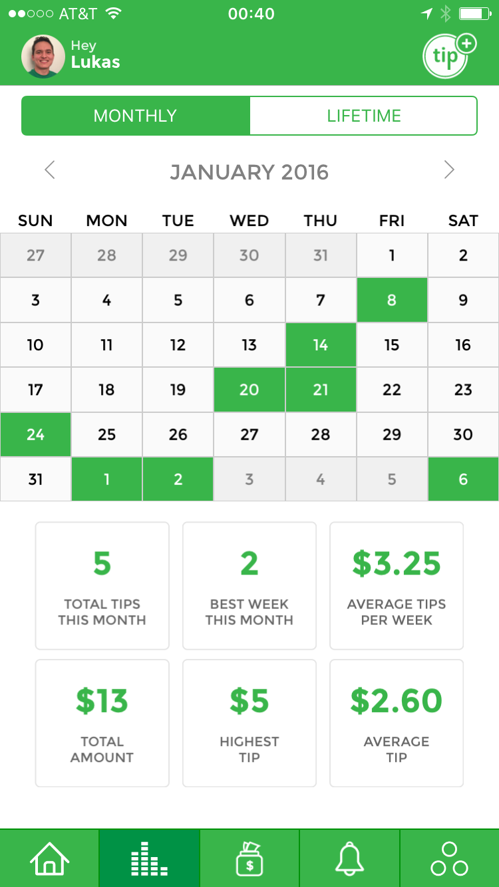
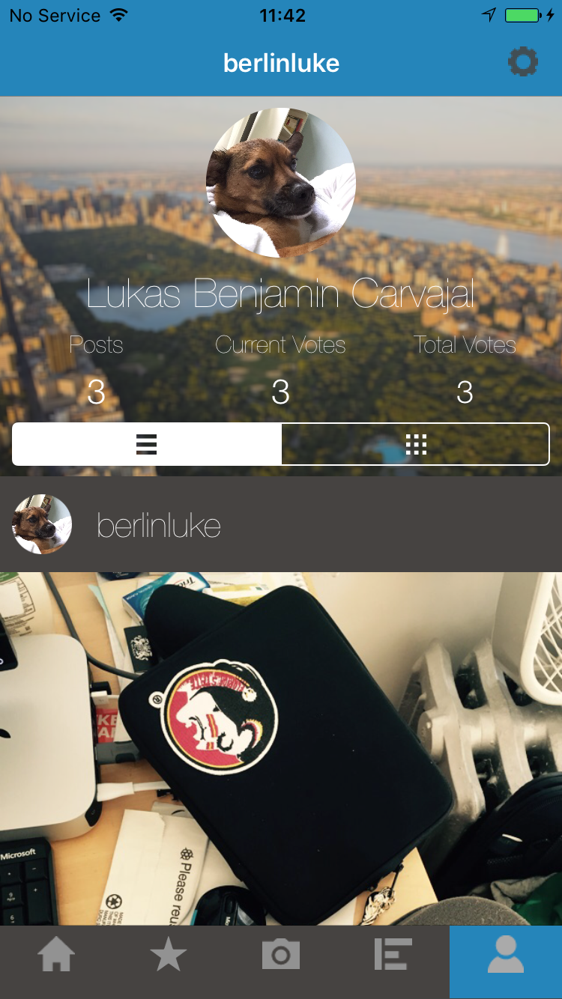

Scroll down to check out the awesome apps I've worked on!  

 

---

 

#Tip Yourself - iOS
Tip Yourself encourages good habits while preparing you financially for your future. By linking your checking account to your tip jar, you can quickly reward yourself for doing something great. In the past, users have given themselves tip for going another day without smoking, working out, and saving money. Check out the other awesome tips people are leaving on <a href="https://itunes.apple.com/us/app/tip-yourself-save-money-build/id987961939?mt=8" target="_blank">Tip Yourself for iOS</a>!

##My Roles
* iOS developer
* Ruby on Rails developer

##Key Features Built
* Launched first version on App Store
* Push notifications and notification settings
* Redesigned and rebuilt entire onboarding process
* Login / Sign up with email
* Private tips
* Sharing tips to Facebook with SDK
* Automatic login and authentication with Auth0
* Login / Sign up welcome view controller
* Redesigned all five tabs

 

	
	
	

 

---

 

#Fraze Frame - iOS and Android
Fraze Frame is the photo sharing competition for college students. Users can upvote and downvote photos in competitions and win prizes. Check out some of its cool photos on the <a href="https://geo.itunes.apple.com/us/app/fraze-frame-photo-competition/id1054162925?mt=8" target="_blank">iOS App</a>!

##My Roles
* iOS developer

##Key Features Built
* Launched first version on App Store
* Login and sign up
* Viewing photos and competitions interface
* Taking photos and placing filters interface
* Viewing and editing profiles interface
* System for ranking photos, flagging photos.
* <a href="http://frazeframe.com" target="_blank">Website for the app and an admin panel for creating and editing competitions.</a>
* Implemented Parse SDK

 

	
	
	

 

---
